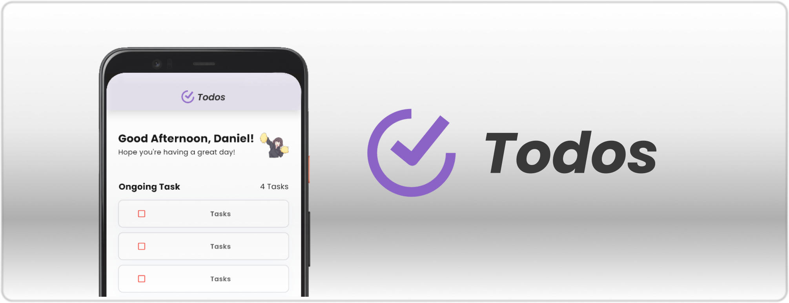

<h1 align="center"> ToDos: To-Do List Application </h1>

A To-Do List Application designed specifically for Mobile Device. This app was made with Flutter Framework and Dart Language.
 
 

## What Does This Application Have?

In this app, users are treated with some things that they can do, like:
-  Add a new task with the "+" button,
-  Edit the information of the previously added task,
-  Delete an existing task,
-  Get a motivational message of the day,
-  Create a simple profile information,

and else!
 
 

## What Did I Learn While Developing This Application?

While developing this to-do list application, I learnt some basic skills of back-end management of a mobile application, especially on mantaining data persistence in my app.

Since I have experienced with designing an UI of a mobile application in <b>Pekan RISTEK Open Class back in 2023</b>, I still can get the designing part without facing a massive trouble. But it still an interesting challange to explore some new ways of designing UI with Flutter and Dart.

 
 
 

    
    <h4>Made by Daniel Liman   Copyright &copy; 2024</h4>

