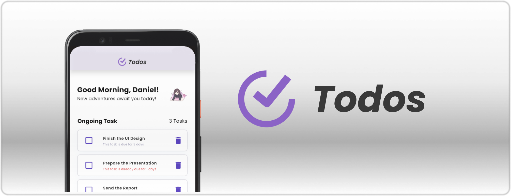

<h1 align="center"> ToDos: To-Do List Application </h1>

A To-Do List Application designed specifically for Mobile Device. This app was made with Flutter Framework and Dart Language.
 
 

## Dependencies

This to-do list app use some state management, path provider and local storage dependencies. The detail list are in the text below:
- **provider (5.0.0)** 
    Simple State Management
- **hive (2.2.3)**, **hive_flutter (1.1.0)** and **hive_generator (2.0.1)** 
    Local Storage for Data Persistence

- **image_picker (1.0.7)** 
    Image Picker from Local Storage

- **intl (0.19.0)** 
    Date Formatting

- **path_provider (2.1.2)** 
    Local Path Provider

- **build_runner (2.1.2)** 
    Help Storing Class Objects to Local Storage

and other general dependencies from the original dependencies

 
 

## What Does This Application Have?

In this app, users are treated with some feature that they can use, such as:
-  Add a new task with the "+" button,  

-  Edit the information of the previously added task,  

-  Check out the completed task (also uncheck it) and delete a task  

-  Get a motivational message of the day,  

-  Create a simple profile information,  
&nbsp;&nbsp;&nbsp;&nbsp;&nbsp;

and else! The tasks also saved in user's local storage, making it sustainable and can be accessed even if user close this application.
 
 

## What Did I Learn While Developing This Application?

While developing this application, I learnt some basic skills of back-end logic and management of a mobile application. I use Provider as a simple state management in my app, maintaining data and states created in my application. I also use Hive for creating a local storage to save some information such as list of tasks, user profile and else to maintain data persistence of what kind of data do my app use.

Since I have learnt some basic knowledge with designing an UI of a mobile application in Pekan RISTEK Open Class back in 2023, I managed to successfully create an user interface and design for my application. Even it's still not as good as what other people can do, it's an interesting challenge to explore some new ways and new kind of widgets such as ListTile, GestureDetector and else to be used in designing UI with Flutter.

In the end, while my application may not be as good as the other's, I know that there's still a long journey ahead to explore the field of Mobile Development. The challenges I faced during this project gave me invaluable experience and driving me to continually refine my skills in Mobile Application Development. The flaws that are found in this application become a stepping stones for me to make an improvement, and I am excited to always and continually learning new things in the field of Mobile Development.

 
 
 

    
    <h4>Made by Daniel Liman   Copyright &copy; 2024</h4>

